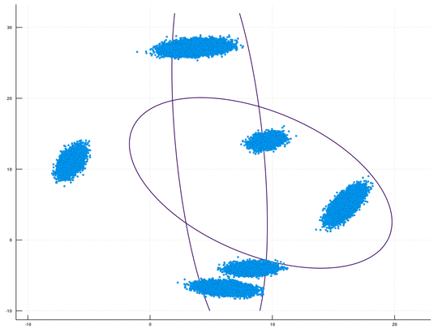

# DPMMSubClusters_GPU
This is a fast GPU implenentation, using CUDA/C++, for sampling-based inference in a Dirichlet Process Mixture Model (DPMM). 
An optional [Python wrapper](https://github.com/BGU-CS-VIL/dpmmpython) is also available. 
This package is Cross Platform (supporting both Windows &amp; Linux). The underlying algorithm is the DPMM sampler proposed by Chang and Fisher III, NIPS 2013.
This repository, together with its [CPU counterpart](https://github.com/BGU-CS-VIL/DPMMSubClusters.jl), is part of our upcoming paper "CPU- and GPU-based Distributed Sampling in Dirichlet Process Mixtures for Large-scale Analysis" (authors: Dinari*, Zamir*, Fisher III, and Freifeld). 

<br>
<p align="center">

</p>


## Requirements
This package was developed and tested with C++14 and CUDA 11.2 on Windows 10 (Visual Studio 2019), Ubuntu 18.04, and Ubuntu 21.04.
The following dependencies are required:
- GPU
- CUDA driver 11.2 or higher
- OpenCV - for visualization purposes (i.e., plotting points in 2D)


## Installation

1. Install CUDA version 11.2 (or higher) from https://developer.nvidia.com/CUDA-downloads
2. git clone https://github.com/BGU-CS-VIL/DPMMSubClusters_GPU
3. Add Environment Variables:
    #### On Linux:
    1. Add "DPMM_GPU_FULL_PATH_TO_PACKAGE_IN_LINUX" with the value of the path to binary of the package DPMMSubClusters_GPU.
    2. Add "CUDA_VERSION" with the value of the version of your CUDA installation (e.g., 11.5).
    #### On Windows:
    1. Add "DPMM_GPU_FULL_PATH_TO_PACKAGE_IN_WINDOWS" with the value of the path to the exe for the package DPMMSubClusters_GPU.
    2. Add "CUDA_VERSION" with the value of the version of your CUDA installation (e.g.,11.5).
4. For Windows only (optional, used on for debugging purposes): Install OpenCV
    1. run Git Bash
    2. cd <YOUR_PATH_TO_DPMMSubClusters_GPU>/DPMMSubClusters
    3. ./installOCV.sh


## Building
For Windows for the CUDA/C++ package both of the build options below are viable. For Linux use Option 2.
- Option 1: DPMMSubClusters.sln - Solution file for Visual Studio 2019
- Option 2: CMakeLists.txt
    1. Run in the terminal: 
        ```
        cd <PATH_FOR_DPMMSubClusters_DIRECTORY>
        mkdir build
        cd build
        cmake -S ../
        ```        
    2. Build:
        - Windows: cmake --build . --config Release --target ALL_BUILD
        - Linux: cmake --build . --config Release --target all


## Usage

The package currently contains priors for handling *Multinomial* or *Gaussian* mixture models.

While being very versatile in the setting and configuration, there are 2 modes which you can work with, either the *Basic*, which will use mostly predefined configuration, and will take the data as an argument, or *Advanced* use, which allows more configuration, loading data from file.

### Basic
In order to run in the basic mode while generating sample data, use the code:
```
srand(12345);
data_generators data_generators;
MatrixXd x;
std::shared_ptr<LabelsType> labels = std::make_shared<LabelsType>();
double** tmean;
double** tcov;
int N = (int)pow(10, 5);
int D = 2;
int numClusters = 2;
int numIters = 100;
data_generators.generate_gaussian_data(N, D, numClusters, 100.0, x, labels,
tmean, tcov);
std::shared_ptr<hyperparams> hyper_params = std::make_shared<niw_hyperparams>(
1.0, VectorXd::Zero(D), 5,
MatrixXd::Identity(D, D));
dp_parallel_sampling_class dps(N, x, 0, prior_type::Gaussian);
ModelInfo dp = dps.dp_parallel(hyper_params, N, numIters, 1, true, false,
false, 15, labels);
```

#### Args and Kwargs:

* all_data - The data, should be `DxN`.
* local_hyper_params - The prior you plan to use, can be either Multinomial, or `NIW`.
* alpha_param - Concentration parameter
* iters - Number of iterations
* verbose - Printing status on every iteration.
* burnout - How many iteration before allowing clusters to split/merge, reducing this number will result in faster inference, but with higher variance between the different runs.
* gt - Ground Truth, if supplied will perform `NMI` and `VI` tests on every iteration.

#### Return values:

`dp_parallel` will return the following `ModelInfo` with few important structures inside it:
```
labels, weights, iter_count
```
Note that `weights` does not sum up to `1`, but to `1` minus the weight of the non-instanisated components.


Reducing the `burnout` will increase the speed and reduce stability, increasing the variance in the results.

When supplied with `gt` kwarg, it will perform `NMI` and `Variation of Information` analysis on each iteration.


### Advanced
There are a few parameters that can be used to run the program. In order to set the hyperparams the `params_path` parameter can be used. The value of the parameter should be a path for a Json file which includes the hyperparams (i.e. `alpha` or `hyper_params` for the prior). In order to use this parameter follow this syntax:
```
--params_path=<PATH_TO_JSON_FILE_WITH_MODEL_PARAMS>
```
There are few more parameters like `model_path` for the path to a npy file which include the model and `result_path` for the path of the output results.
Our code has support for both Gaussian and Multinomial distributions. It can be easily adapted to other component distributions, e.g., Poisson, as long as they belong to an exponential family. The default distribution is Gaussian. To specify a distribution other than a Gaussian, use the `prior_type` parameter. For example:
```
--prior_type="Multinomial"
```
The Json file containing the model parameters can contain many parameters that can be controlled by the user. A few examples are: alpha, prior, number of iterations, burn_out and kernel. The full list of parameters can be seen in the function `init()` in `global_params`. The result file is a Json file which by default contains the predicted labels, the weights, the Normalized Mutual Information (NMI) score and the running time per iteration. A few other parameters can be added to the result file. Samples for these additional parameters are commented out in the `main.cpp` file.

### Misc

For any questions: dinari@post.bgu.ac.il or razzam@post.bgu.ac.il

Contributions, feature requests, suggestions etc.. are welcome.
